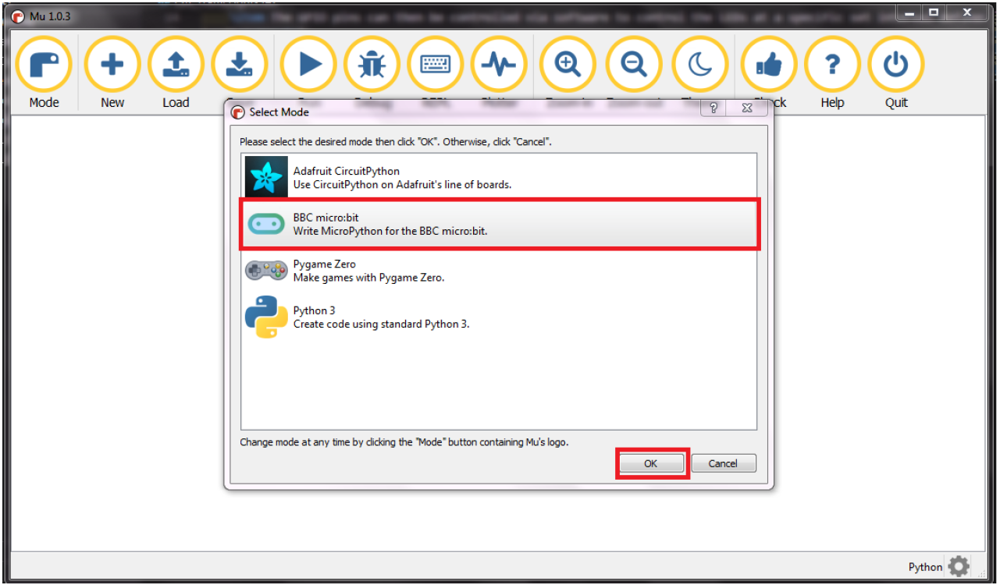
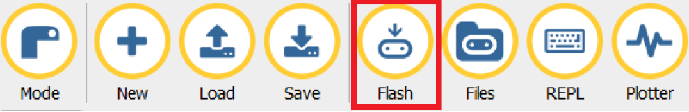

# Step Counter using BBC Micro:bit

## Installing Mu Editor and setting up Micro:bit

1. In order to run python code on the Micro:bit, you will first need to install Mu editor from [here](https://codewith.mu)
2. Once downloaded, start the installer and complete the guided installation.
3. Open Mu editor. On the **"Select Mode"** dialog box, choose **"BBC micro:bit"** and press the "Ok" button.

  

## Writing code and uploading

1. A new project window will open.
2. Copy the code from **`step_counter.py`** and paste it into the editor.
3. Press the **"Flash"** button.

4. Locate the Micro:bit in the Windows Explorer dialog box and press the select folder button.
5. Once flashed successfully, the micro:bit will start counting steps when you shake it